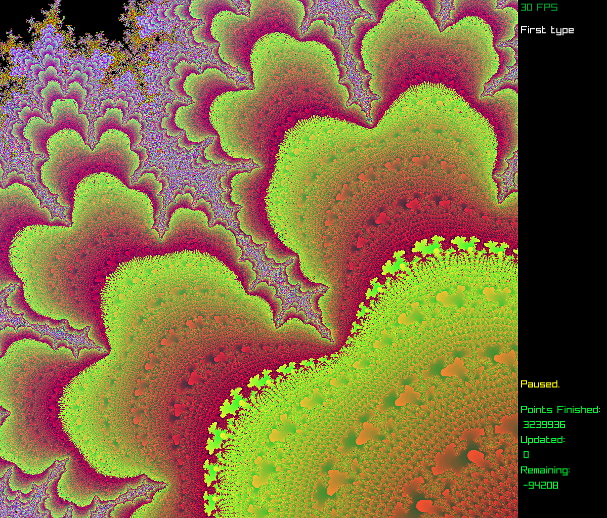

# FloatCompMandelbrot
What impact does floating point precision have on Mandelbrot set calculations?

## The Problem In A Nutshell
How much is a Mandelbrot set image affected by the floating point precision of the code used to compute it?

1. The points in a region of a Mandelbrot set image have *sensitive dependence upon initial conditions.*  (This property is the "chaos" in "chaos theory.")  A small deviation in the value of C in Z=Z^2+C can lead to a very different outcome for one point versus another point that is only a miniscule distance from it.  This fact remains true at all scales of magnification, i.e., "miniscule" can be arbitrarily small. 
2. Floating point math cannot perfectly represent many rational numbers.  Moreover, floating point math can generate inaccuracies that can snowball with repeated calculations, including repeated operations of multiplication and addition.  Repeated multiplication and addition are the core of the Mandelbrot set algorithm.
3. Since the Mandelbrot set is always generated on a computer, typically using floating point math of some precision or other, how much of a Mandelbrot set image's visual complexity is due to the mathematical properties of the algorithm, and how much is due to floating point inaccuracies in its computer calculation?  Could some of the familiar visual properties of the Mandelbrot set simply be due to the "noise" introduced by floating point calculations that have iterated thousands or even millions of times?

### The Problem at Large
This question has been posed [at least once on Stack Exchange](https://math.stackexchange.com/questions/2731582/are-the-intriguing-and-lovely-mandelbrot-set-hoops-and-curls-the-result-of-float) but the original post was not understood, so no satisfactory answer resulted.

A 2013 academic paper, ["Images of Julia Sets That You Can Trust" ](https://mathr.co.uk/blog/2018-08-20_trustworthy_fractals.html), by L. H. de Figueiredo, D. Nehab, J. Stolfi, and J. B. Oliveira, raises similar questions for Julia sets, which are mathematical relatives of the Mandelbrot set.

### Background
If you are unfamiliar with the limitations of floating point arithmetic, read the classic essay ["What Every Computer Scientist Should Know About Floating-Point Arithmetic"](https://docs.oracle.com/cd/E19957-01/806-3568/ncg_goldberg.html) by David Goldberg for a good overview.  Basic introductions to the math involved in generating the Mandelbrot set are ubiquitous, but also good to read if you are unfamiliar with the algorithm.

## The Solution in a Nutshell
I wrote easy-to-modify code C++ that simply uses `typedef` to allow the user to explore the Mandelbrot set and to compare how the same Mandelbrot set image looks when generated using the same parameters but with three different floating-point implementations of different precision.  In addition to standard `float` and `double`, the `Boost::Multiprecision` [cpp_bin_float](https://www.boost.org/doc/libs/1_79_0/libs/multiprecision/doc/html/boost_multiprecision/tut/floats/cpp_bin_float.html) class was used to implement extended-precision floating-point types of arbitrarily high precision.

The multi-threaded program generates the desired Mandelbrot set image in all three precisions simultaneously.  Keys `<1>`, `<2>`, and `<3>` display the image as generated by the three different types of floating point precision that the user has selected.  Keys `<4>`, `<5>`, and `<6>` subtract pairs of images to highlight any pixels that are different:

- `Key <4>` -- Subtracts image 1 from 2
- `Key <5>` -- Subtracts image 1 from 3
- `Key <6>` -- Subtracts image 2 from 3

Green pixels indicate a positive value following the subtraction, red pixels a negative value.
Basic statistics of the comparison are given in console output, such as the total number of pixels that are different, the percentage of the total image that is different, and the greatest difference between the values of the pixels (which tends to be close to the max iterations that one has selected for the Mandelbrot algorithm).

### An Example
Here are some sample images from a zoom in the neighborhood of C = -0.6702 + 0.4580i. Magnification is approximately 10^15. The distance between adjacent pixels is 1/(2^49).  Max iterations is 20K.  For my three types of float I chose `double` (53 bits of precision on my platform), `long double` (64 bits of precision) and `cpp_bin_float_quad` (113 bits of precision).  Here's a picture of the standard double:

