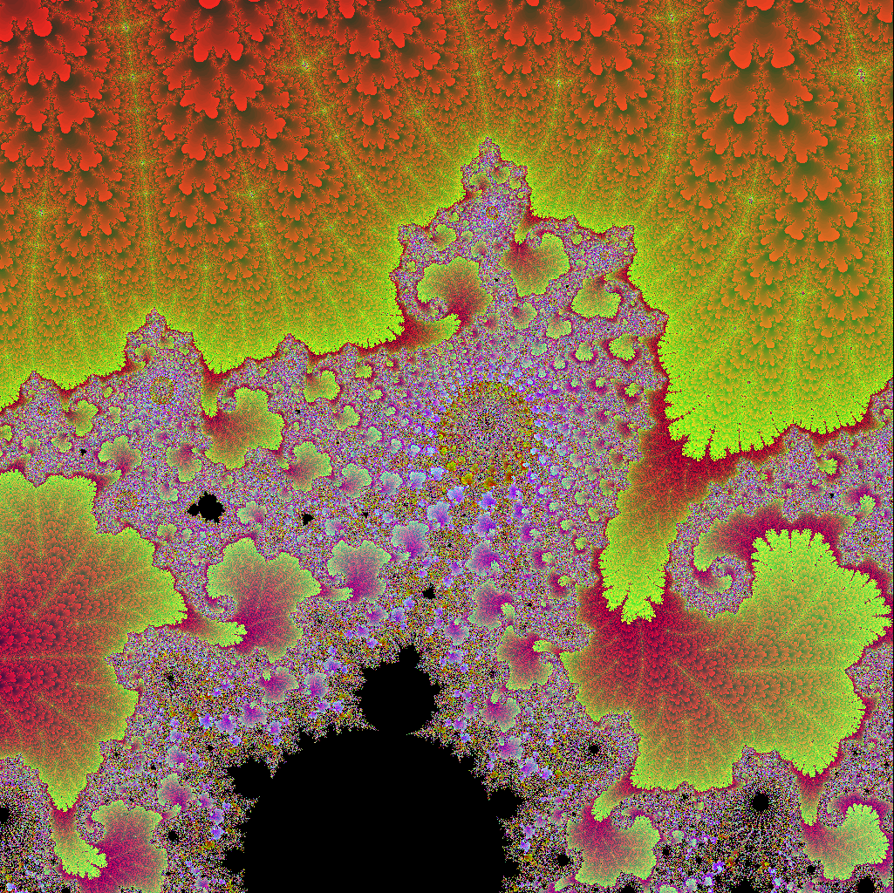
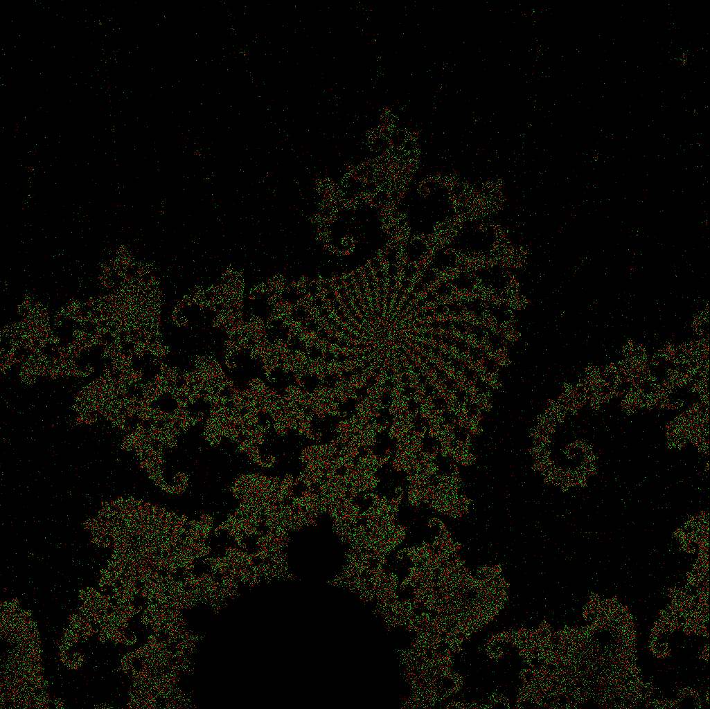
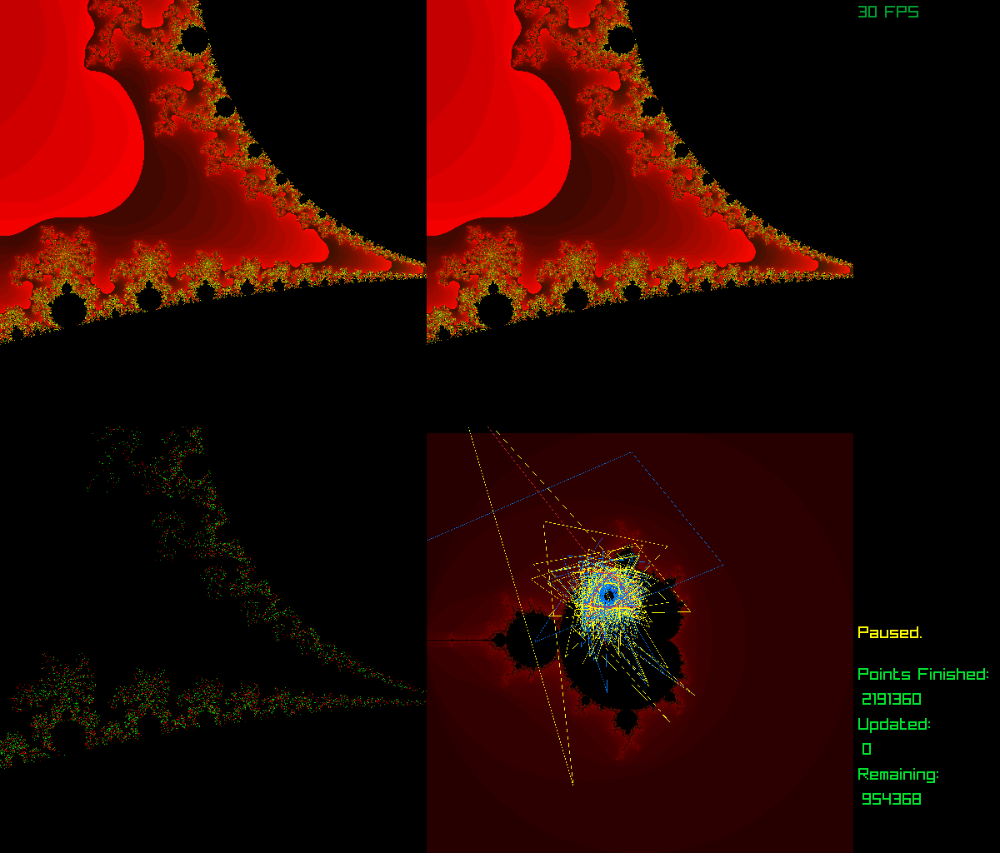
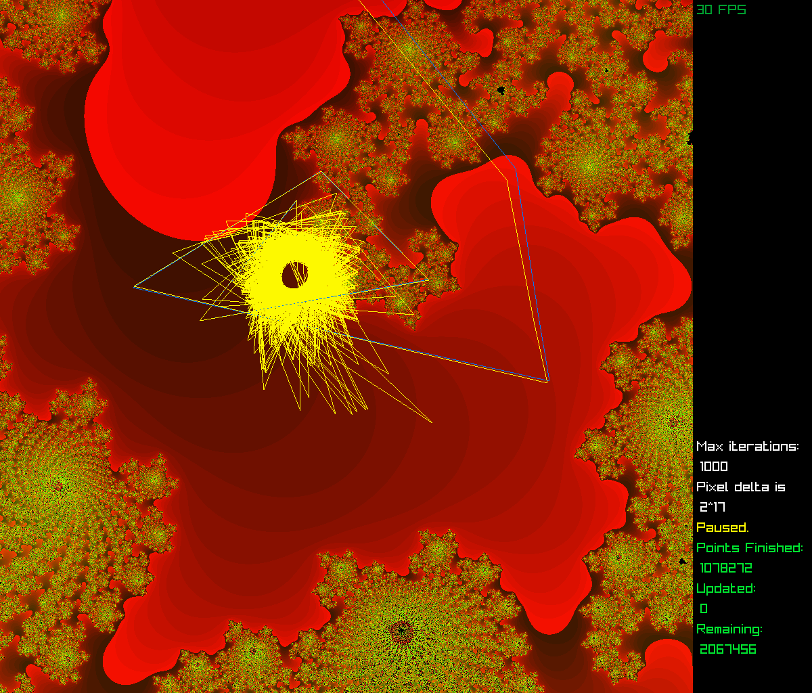

# FloatCompMandelbrot
A program to explore how Mandelbrot set images are affected by floating point precision.

Dependencies: [Boost::Multiprecision](https://www.boost.org/doc/libs/1_79_0/libs/multiprecision/doc/html/index.html) (How to Install Boost:[Getting Started](https://www.boost.org/doc/libs/1_79_0/more/getting_started/index.html) ) and [RayLib](https://github.com/raysan5/raylib) for graphics.  Boost::Multiprecision may be easily replaced by other floating-point or rational implementations, like GiMP or GMPF by just changing the `#include`s and `typedef`s at the beginning.

## The Problem In A Nutshell
How much is a Mandelbrot set image affected by the floating point precision of the code used to compute it?

1. The points in a region of a Mandelbrot set image have *sensitive dependence upon initial conditions.*  (This property is the "chaos" in "chaos theory.")  A small deviation in the value of C in Z=Z^2+C can lead to a very different outcome for one point versus another point that is only a miniscule distance from it.  This fact remains true at all scales of magnification, i.e., "miniscule" can be arbitrarily small. 
2. Floating point math cannot perfectly represent many rational numbers.  Moreover, floating point math can generate inaccuracies that can snowball with repeated calculations, including repeated operations of multiplication and addition.  Repeated multiplication and addition are the core of the Mandelbrot set algorithm.
3. Since the Mandelbrot set is always generated on a computer, typically using floating point math of some precision or other, we ask: How much of a Mandelbrot set image's visual complexity is due to the mathematical properties of the algorithm, and how much is due to floating point inaccuracies in its computer calculation?  Could some of the familiar visual properties of the Mandelbrot set simply be "noise" introduced by floating point calculations that have iterated thousands or even millions of times?

### The Problem at Large
This question has been posed [at least once on Stack Exchange](https://math.stackexchange.com/questions/2731582/are-the-intriguing-and-lovely-mandelbrot-set-hoops-and-curls-the-result-of-float) but the original post was not understood, so no satisfactory answer resulted.

A 2013 academic paper, ["Images of Julia Sets That You Can Trust" ](https://mathr.co.uk/blog/2018-08-20_trustworthy_fractals.html), by L. H. de Figueiredo, D. Nehab, J. Stolfi, and J. B. Oliveira, raises similar questions for Julia sets, which are mathematical relatives of the Mandelbrot set.

### Background
If you are unfamiliar with the limitations of floating point arithmetic, read the classic essay ["What Every Computer Scientist Should Know About Floating-Point Arithmetic"](https://docs.oracle.com/cd/E19957-01/806-3568/ncg_goldberg.html) by David Goldberg for a good overview.  Basic introductions to the math involved in generating the Mandelbrot set are ubiquitous if you are unfamiliar with the algorithm.

### The Problem and Solution in More Detail
For a more detailed statement of the problem and the design of this program, [read the more detailed analysis here](./FloatCompMset.md).

## My Solution in a Nutshell
I wrote easy-to-modify c++ code that simply uses `typedef` to allow the user to explore the Mandelbrot set and to compare how the Mandelbrot set image looks when generated using the *same parameters* on the *same points*, but using three different floating-point implementations to calculate the result.  In addition to standard `float` and `double` types, the `Boost::Multiprecision` [cpp_bin_float](https://www.boost.org/doc/libs/1_79_0/libs/multiprecision/doc/html/boost_multiprecision/tut/floats/cpp_bin_float.html) class was used to implement extended-precision floating-point types of the user's choice.

The program is multi-threaded so it generates the desired Mandelbrot set image in all three float types simultaneously.  Keys `<1>`, `<2>`, and `<3>` display the image as generated by the three different types of floating point precision that the user has selected.  Keys `<4>`, `<5>`, and `<6>` _subtract pairs of images_ to highlight any pixels that are different:

- `Key <4>` -- Subtracts image 1 from 2
- `Key <5>` -- Subtracts image 1 from 3
- `Key <6>` -- Subtracts image 2 from 3

Green pixels indicate a positive value following the subtraction, red pixels a negative value.
Basic statistics of the comparison are given in console output, such as the total number of pixels that are different, the percentage of the total image that is different, and the greatest difference between the values of the pixels (which tends to be close to the max iterations that one has selected for the Mandelbrot algorithm).  The console output also prints basic information about the three types one has chosen at start-up, such as digits of precision.

### An Example
Here are some sample images from a zoom in the neighborhood of C = -0.104943 + 0.927572i. Magnification is approximately 33E+6. The distance between adjacent pixels is 1/(2^33).  Max iterations is 30K.  Here's the image generated with standard `double` (53 bits of precision):




Here is the same image generated with `cpp_bin_float_quad` (113 bits of precision).  Superficially it looks largely the same:


But upon subtraction, we find that 8.77% ofthe pixels are different!  92,007 out of 1,048,576 pixels have different values.  These differences include points estimated to be in the Mandelbrot Set in one image and not in the other, as well as points which exceeded the orbit boundary check (i.e., the magnitude of Z > 2) in both images but at different iterations.  Here's what we get when we subtract the Quad image from the Double precision image and color-code the difference:



Green pixels are where Quad > Double; red pixels are where Double > Quad.

### Four Screen View
Press `Key <7>` with the mouse over a pixel in screen views 1, 2 or 3 to trigger Four-Screen view.  Top left and right are float types 1 and 2.  Bottom left is the difference between them.  The bottom right screen displays the trajectory of the point against the background of the whole Mandelbrot set.  The first float type is plotted in blue, the second in red, the third in yellow.  This allows you to see how different floating point implementations lead to different trajectories, which lead to different final values for a single point in the image.  



### Trajectory view
Press `Key <8>` to see the trajectory screen by itself.  In this display mode, the background remains that of the zoomed-in image, rather than the whole Mandelbrot set, but the screen coordinates of the trajectories are still (-2-2i) to (2+2i).  Leaving the background image of the zoomed-in fractal better allows you to select a point where trajectories clearly diverge, which are often near the edges of the set or other high-chaos areas.



## Lines to Customize in the Code
The three floating point types are `typedef`ed as `first_float`, `second_float` and `third_float` throughout the code.  Variable names also have these names as suffixes.  Yes, templated code would be more elegant than coding everything in triplicate!  I began with templated code, but finding the proper arguments to pass to `std::asynch` for templated overloaded functions proved too hard.

Places to customize your settings are preceded by the comment tag `// OPTION`, for which string you can search.  The basic options are below.  The first setting is the most important: selecting your floating point types.

### Set your types
Alter these three lines in the code to choose your own floating point implementations and _voila!_ You are all set to go.  It will be helpful to order your types from the least precise for `first_float` to the most precise for `third_float`.
```
typedef double first_float;
typedef cpp_bin_float_quad second_float;
typedef cpp_bin_float_oct third_float;
```

### Tweak your multi-threading preferences (optional)
Depending on how many cores you have you may wish to change `unsigned int numThreads;` This setting creates `numThreads` _for each of the three floating point types_.  So `unsigned int numThreads=4;` will start 12 threads initially.  Built-in types (like `float`, `double,` `long double`) go much faster on most platforms because of intrinsic processor support.  So threads dedicated to those types will finish far sooner than those using  `Boost::multiprecision`'s `cpp_bin_float` types.  Software-emulated floating-point support is always slower.  That's why they invented FPUs.

Each thread calculates a batch of pixels at a time.  You can tweak the amount per batch here:
```
unsigned int batchSize_first_float=10240;
unsigned int batchSize_second_float=2048;
unsigned int batchSize_third_float=512;
```
Choosing a built-in type like `double` for the `first_float` type, and asigning it a large number of pixels per batch (like 10K above), can be useful to display an image quickly on screen 1 to help perfect your center and zoom.

### Tweak how your starting point is calculated (optional)
Every pixel on the screen has X and Y coordinates (ranging 0-1023) which correspond to some point on the complex plane and constitute the value of C in the formula Z=Z^2+C.  Presuming that your floating point types range from least precise (for `first_float`) to most precise, as you zoom deeper, the calculation of C will begin to be affected by the precision of your floating point types, beginning with `first_float` losing precision in its last decimal places.  You can choose whether to start iterating with a value for C that is calculated separately for each type, in its own precision, which may lead to slightly different values for C.  Or you can start iterating with the exact same value for C for all types by simply casting the value for C in `first_float` into the higher-precision types.  The latter approach can highlight differences in value due solely to floating-point inaccuracy accumulated through iteration.

## Basic program controls
The **mouse left-click** is used to recenter the image; keys are used for everything else.  Recentering and zooming takes a few seconds for the screen to reset.  The GUI interface is functional but not as pretty or convenient as professional programs.  This tool is made for research.  Get Ultrafractal or Kalles Fraktaler to make beautiful images easily.  My color palette is ugly as sin.

- **Period** - Zooms in by a factor of two
- **Comma** - Zooms out by a factor of two.
- **Semi-colon** - Zooms in by a factor of eight.  These are the only zoom controls.
- **M, K, O** - Increase max iterations by 1, 10 or 100, respectively.  **Shift+O** increases to the nearest whole 1000.
- **N, J, I** - Decrease max iterations by 1, 10 or 100, respectively.  **Shift+I** decreases by 1000.
- **P** - Pause calculation toggle.  This waits for existing threads to complete and then waits for unpause to spawn new ones, so its effect is not instant if you are working on some computationally intensive threads which must finish first.  Keep your batch sizes small for responsiveness.
- **U** - Unpause.  Doesn't toggle.
- **R** - Revert to prior coordinates for image center.  Works once.
- **C** - Toggle a small semi-transparent indicator of the center of the screen.  Useful for zooming.
- **G** - Toggle a semi-transparent grid overlay with circles various radii and a rectangle around the middle of the screen.  Useful for centering the screen before zooming and estimating orbits.
- **/** (Forward slash) with mouse over a pixel - Gives coordinate info for that pixel in console
- **8** with mouse over a pixel - Plots trajectory of that point (screen mode 8) in all three types.


# The Problem and Solution in More Detail
For a more detailed statement of the problem and the design of this program, [read the more detailed analysis here](./FloatCompMset.md).
